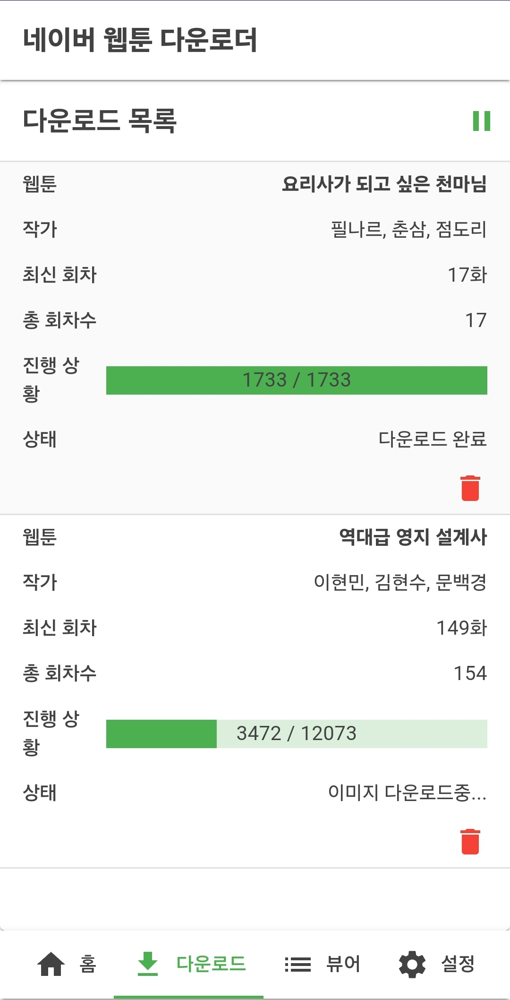
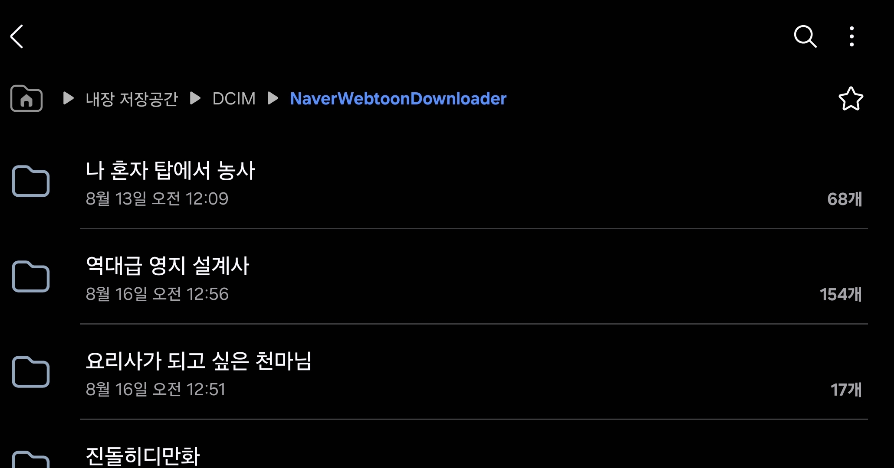
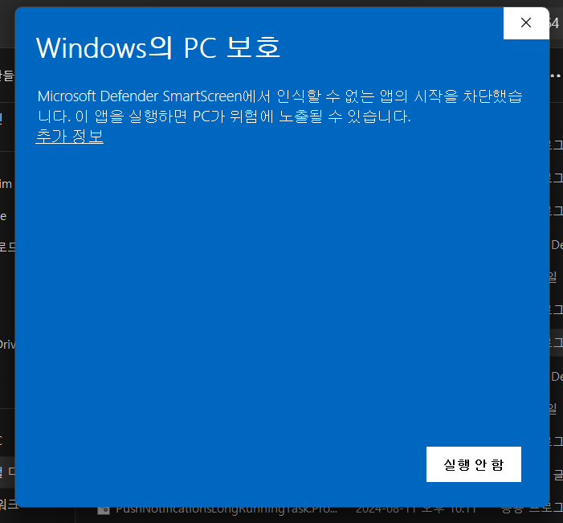
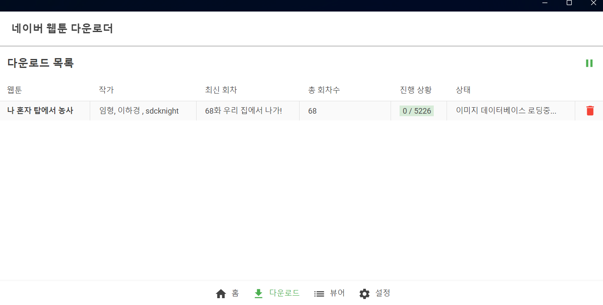
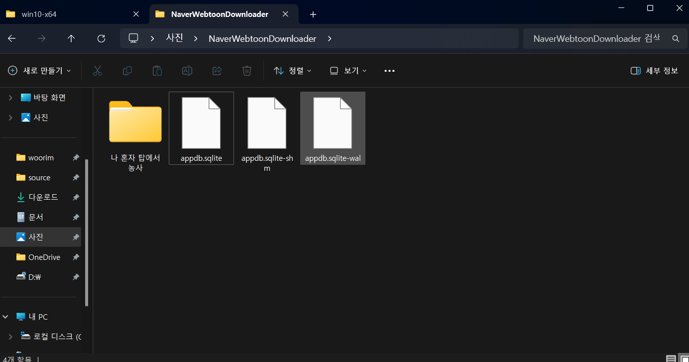

## 네이버 웹툰 다운로더

  
  
  

  

  

  

.NET MAUI Blazor Hybrid 로 개발된 네이버 웹툰 다운로더입니다.  
뷰어가 내장되어 있어 다운로드한 웹툰을 바로 볼 수 있습니다.  
[안드로이드 APK 다운로드](https://github.com/woorim02/Naver-Webtoon-Downloader/releases/download/v0.1.3/NaverWebtoonDownloader.apk)  
[윈도우 exe ZIP 다운로드](https://github.com/woorim02/Naver-Webtoon-Downloader/releases/download/v0.1.3/NaverWebtoonDownloader-win10-x64.zip)

## Android
### 안드로이드 이미지 다운로드 위치 

다운로드된 이미지는 **DCIM/NaverWebtoonDownloader** 폴더에서 확인 가능합니다.

## Windows
### 설치 방법  
1. [Releases](https://github.com/woorim02/Naver-Webtoon-Downloader/releases) 페이지에서 win10-x64.zip
파일을 다운로드 하고 압축을 풀어주세요.  

2. 폴더 안에서 exe 파일을 찾아 실행하시면 됩니다.
   

3. 주의사항  
 CA 인증서로 서명된 exe 파일이 아니므로 초기 실행시에 윈도우 PC 보호 창이 표시 될 수 있습니다.   
- **해당 메세지는 프로그램이 위험하다는 의미가 아닙니다.**  
 추가 정보 버튼을 클릭하여 앱 실행이 가능합니다.
 

### 윈도우 이미지 다운로드 위치 

다운로드된 이미지는 윈도우의 **사진/NaverWebtoonDownloader** 폴더에서 확인 가능합니다.
